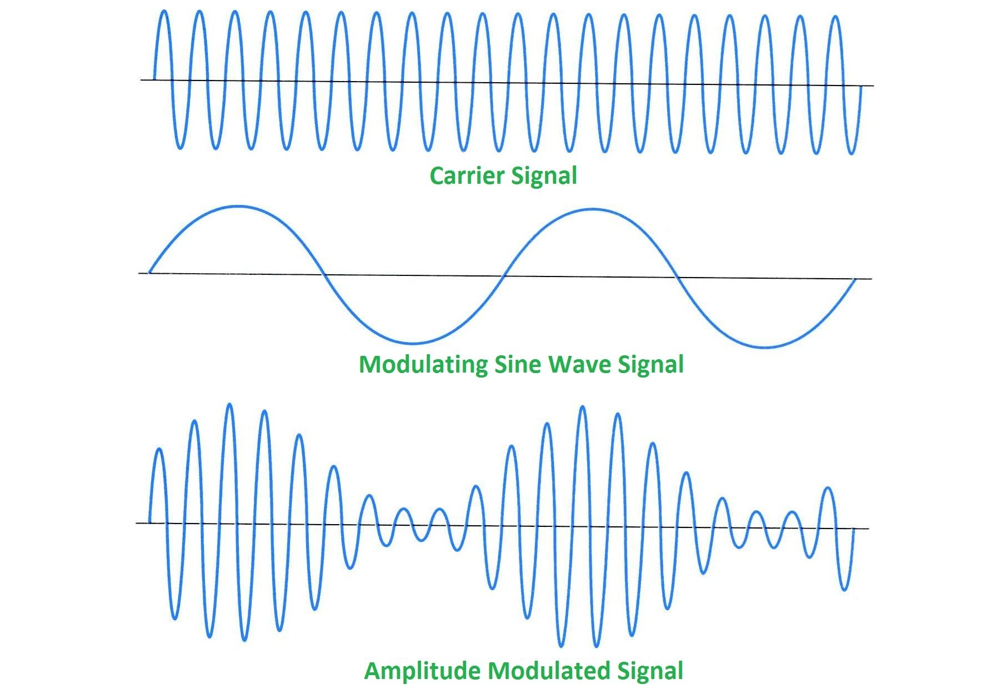

title: "DOMSTEP: A Browser Dance Party"
author:
  name: Jamison Dance
  twitter: jergason
  url: http://jamisondance.com
controls: false
style: styles/style.css

--

#DOMSTEP

A Browser Dance Party

--

#Who Am I

* [@jergason](http://twitter.com/jergason)
* [jergason](https://github.com/jergason) on GitHub for assorted dumb things
* [JavaScript Jabber](http://javascriptjabber.com), a podcast

--

#24601

--

#Who Am I

* [@jergason](http://twitter.com/jergason)
* [jergason](https://github.com/jergason) on GitHub
* [JavaScript Jabber](http://javascriptjabber.com), a podcast
* Former international rock superstar

--

<button class="play-goodsman">Unleash The Thunder</button>

<!--this is my highschool band The Goodsman Brothers.-->

--

# Let's start an EDM band

<!--EDM is what pretentious people say instead of dubstep.
It also means we don't need to know how to play an instrument or really
do anything besides program.-->

--

# Web Audio API

<!-- The web audio api is the solution to all our problems!
There is an AudioContext, which is basically a container for nodes and buffers.
You use the context to construct this graph of nodes, and then pipe the sounds
through the nodes to make beautiful music.-->

--

#An Example!

Beep Boop
<button class="sine-demo">Beep It Up</button>

<!-- show the code! -->

--

#How Does Sound Even Work

<!-- We need to talk a little bit about how sound works in general, and
about how it works in computers.

What we percive as sound is really waves of pressure. These waves travel
through the air until they reach your ear, where they cause hairs in your
ear to vibrate. These vibrations get turned in to electrical signals,
which travel through your cochlear nerve to the brain, where you percieve them
as sound.-->

--

#Our Sound Wave

<canvas class="sinwave" height="500" width="500"></canvas>
<input class="sinwave-range" type="range" min="100" max="300">
<button class="sin-viz-demo">Beep Boop</button>

<!-- Let's look again at the wave we were making last time, and also take a
second to talk about how computers process and manipulate audio.

Here you can see the sound wave we were making before. Check it out, it is a
sine function. You can see the amplitude go up and down. The frequency of the
wave is the time to go through one cycle. Since our frequency is 300, that
means the wave goes up and down 300 times per second.

We hear frequency as pitch. The higher the frequency (the shorter the distance
between waves) the higher the pitch. SHOW EXAMPLE OF RAISING AND LOWERING
THE FREQENCY TO SEE HOW IT CHANGES -->

--

#How Computers Process Audio

<!-- why is this slide here? what do they know after this slide that
they wont know before that they need to understand the presentation? -->

<!-- The wave we were looking at before was a sine wave, which we have functions
to easily calculate. However, computers don't usually represent sound as
a functino that would generate the wave. This would get way too complex as
the sound grows more complex. Instead, they use something called PCM to
represent sound as a buffer of numbers.

You divide the curve up into chunks, measure it at each chunk, and end up
with an array of numbers representing the amplitude of the curve at each
point. In JS these are floats, and there are 44,000 samples per second.
at 64 bits * 44000, that is 2816000 bits, or 340kB per second. SUPER ineficcient -->

--

#The Worst Theramin

--

#Loading Buffers

<button class="goodsman-demo">Unleash The Thunder</button>

<!-- Show the code! Get the audio context, make a node, connect it to the
desination. -->

--

#Dropping The Beats

<textarea class="beats" rows="6" cols="30">
hh| -- -- -- -- -- -- -- -- |
sn| -- -- sn -- -- -- -- -- |
bd| bd -- -- -- -- -- bd -- |
</textarea>
<button class="drop-the-beat">Drop The Beat</button><button class="stop-the-beat">Stop The Beat</button>

--

##The secret of wob

--

#Wob Example
<button class="wob-it-up">Wob It Up</button><button class="stop-wob-it-up">Stop The Wob</button>

--

#You Are Also In Our Band

--

#Putting it together

<textarea class="wobble-beats" rows="6" cols="100">
bd| bd -- -- -- -- -- -- -- | bd -- bd -- -- -- -- -- | bd -- -- -- -- -- -- -- | bd -- bd -- -- -- -- -- |
sn| -- -- -- -- sn -- -- -- | -- -- -- -- sn -- -- -- | -- -- -- -- sn -- -- -- | -- -- -- -- sn -- -- -- |
hh| -- -- hh hh -- -- -- -- | -- -- hh hh -- -- -- -- | -- -- hh hh -- -- -- -- | -- -- hh hh -- -- -- -- |
</textarea>

<button class="drop-the-wobble-beat">Drop The Beat</button><button class="stop-the-wobble-beat">Stop The Beat</button>

--

# Learn More

* [The Spec](http://webaudio.github.io/web-audio-api/)
* [Signal Processing With The Web Audio API](https://www.youtube.com/watch?v=YBQ5pzvgbOE)
* [O'Reilly Book](http://chimera.labs.oreilly.com/books/1234000001552/pr01.html)
* [Getting Started With Web Audio API](http://www.html5rocks.com/en/tutorials/webaudio/intro/)

